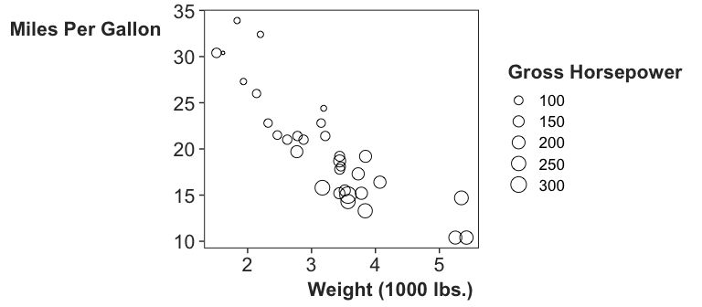

README
================

# Overview

This R package contains functions that I use often to create plots.

At the moment, there’s just `theme_carly_presents()`, which simplifies
`ggplot2::theme_bw()` a bit for a low-resolution format like
presentations.

# Installation

    devtools::install_github("carlislerainey/ggcarly")

# Examples

## Scatterplot

``` r
# load packages
library(ggplot2)
library(ggcarly)

# scatterplot
ggplot(mtcars, aes(wt, mpg, size = hp)) + 
  geom_point(shape = 21) + 
  labs(x = "Weight (1000 lbs.)",
       y = "Miles Per Gallon",
       size = "Gross Horsepower") + 
  theme_carly_presents()
```

<!-- -->

## Bar Plot

``` r
# load packages
library(ggplot2)
library(ggcarly)

# scatterplot
ggplot(mpg, aes(class)) + 
  geom_bar() + 
  coord_flip() + 
  theme_carly_presents()
```

<!-- -->
