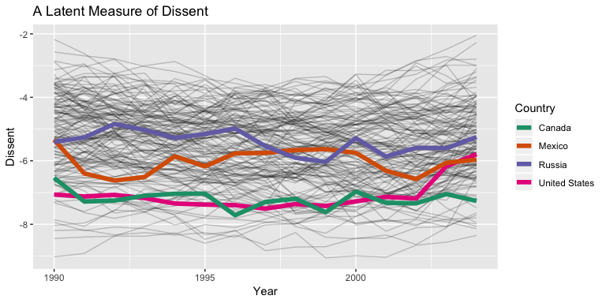

README
================

# Overview

For the future, I intend for this package to contain functions that I
use to create plots.

At the moment, there’s just `theme_carly_presents()`, which simplifies
`ggplot2::theme_bw()` a bit for a low-resolution format like
presentations. I’mm just testing it as a proof of concept. You can see
[an
example](https://speakerdeck.com/carlislerainey/ggcarly-theme-carly-presents)
I put on SpeakerDeck. I also added several examples below.

# Installation

    devtools::install_github("carlislerainey/ggcarly")

# Examples

## Latent Dissent

``` r
# load packages
library(tidyverse)
library(ggcarly)

# load latent dissent data
dissent_df <- read_csv("https://raw.githubusercontent.com/carlislerainey/latent-dissent/master/latent-dissent.csv") %>% 
  glimpse()
```

    ## Observations: 2,220
    ## Variables: 9
    ## $ country_name        <chr> "United States", "United States", "United ...
    ## $ ccode               <int> 2, 2, 2, 2, 2, 2, 2, 2, 2, 2, 2, 2, 2, 2, ...
    ## $ stateabb            <chr> "USA", "USA", "USA", "USA", "USA", "USA", ...
    ## $ year                <dbl> 1990, 1991, 1992, 1993, 1994, 1995, 1996, ...
    ## $ n_dissent_events    <int> 118, 109, 124, 138, 127, 117, 123, 130, 14...
    ## $ frac_dissent_events <dbl> 0.0008706110, 0.0007745053, 0.0008202143, ...
    ## $ pi                  <dbl> 0.0008594584, 0.0008084815, 0.0008504707, ...
    ## $ eta                 <dbl> -7.063373, -7.123618, -7.073412, -7.175113...
    ## $ se_eta              <dbl> 0.10025341, 0.09037413, 0.09554201, 0.0919...

``` r
# plot eta
p <- ggplot(dissent_df, aes(x = year, y = eta, group = ccode)) + 
  geom_line(alpha = 0.2) + 
  geom_line(data = filter(dissent_df, country_name %in% c("United States", "Canada", "Mexico", "Russia")),
              aes(x = year, y = eta, color = country_name), alpha = 1, size = 2) + 
  scale_color_brewer(type = "qual", palette = 2) + 
  labs(title = "A Latent Measure of Dissent",
       x = "Year",
       y = "Dissent",
       color = "Country")

# default theme
p
```

<!-- -->

``` r
# bw theme
p + theme_bw()
```

<!-- -->

``` r
# minimal theme
p + theme_minimal()
```

<!-- -->

``` r
# carly_presents
p + theme_carly_presents()
```

<!-- -->

## Scatterplot

``` r
# load packages
library(ggplot2)
library(ggcarly)

# scatterplot
ggplot(mtcars, aes(wt, mpg, size = hp)) + 
  geom_point(shape = 21) + 
  labs(x = "Weight (1000 lbs.)",
       y = "Miles Per Gallon",
       size = "Gross Horsepower") + 
  theme_carly_presents()
```

<!-- -->

## Bar Plot

``` r
# load packages
library(ggplot2)
library(ggcarly)

# barplot
ggplot(mpg, aes(class)) + 
  geom_bar() + 
  coord_flip() + 
  theme_carly_presents()
```

<!-- -->

## Facetted Scatterplot

``` r
# load packages
library(ggplot2)
library(ggcarly)

# facetted scatterplot
ggplot(mpg, aes(displ, hwy)) + 
  geom_point() + 
  facet_wrap(vars(class)) + 
  theme_carly_presents()
```

<!-- -->

## Histogram

``` r
# load packages
library(ggplot2)
library(ggcarly)

# dotplot
ggplot(mtcars, aes(x = mpg)) + 
  geom_histogram(bins = 10) + 
  theme_carly_presents()
```

<!-- -->

## Dot-and-Box Plot

Example from
[here](http://r-statistics.co/Top50-Ggplot2-Visualizations-MasterList-R-Code.html#Dot%20+%20Box%20Plot).

``` r
# load packages
library(ggplot2)
library(ggcarly)

# dot-and-box plot
g <- ggplot(mpg, aes(manufacturer, cty))
g + geom_boxplot() + 
  geom_dotplot(binaxis='y', 
               stackdir='center', 
               dotsize = .5, 
               fill="red") +
  theme(axis.text.x = element_text(angle=65, vjust=0.6)) + 
  labs(title="Box plot + Dot plot", 
       subtitle="City Mileage vs Class: Each dot represents 1 row in source data",
       caption="Source: mpg",
       x="Class of Vehicle",
       y="City Mileage") + 
  theme_carly_presents() + 
  theme(axis.text.x = element_text(angle = 60, vjust = 1, hjust = 1))
```

    ## `stat_bindot()` using `bins = 30`. Pick better value with `binwidth`.

<!-- -->
